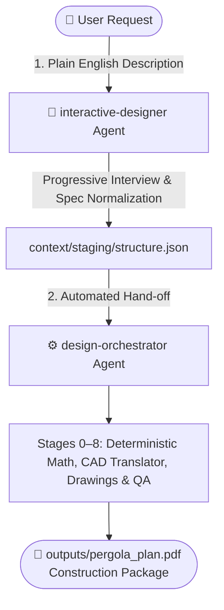

# 🏡 Garden Structure Designer (Agent Plugin)

> **Translate your backyard vision into build-ready architectural reality without needing an engineering degree.**

The **Garden Structure Designer** is a modular, AI-native plugin built for advanced agentic environments (like Claude Cowork, Antigravity, and Gemini CLI). It acts as your personal master builder and timber framer—taking hazy, non-technical descriptions of pergolas, gazebos, or pavilions and translating them into structurally sound, permit-ready construction PDF plans.

---

## 🎯 Target Audience
- **Homeowners & Novice DIYers:** You know what you want it to look like, but you don't know the span mathematics to guarantee it won't collapse under winter snow.
- **Professional Carpenters & Builders:** You want a rapid way to generate professional intake documents, accurate visual references, and precise cut-lists for your clients while offloading the repetitive drafting work.

---

## 🚀 The Guided Discovery Process

Generalized AI struggles to design physical structures reliably because the required architectural pipeline is too complex for a single prompt, almost always leading to hallucinations in angles, board-feet, and span physics. 

This plugin solves that by migrating away from LLM-guessing toward a **deterministic, artifact-verified engineering pipeline**. It encapsulates an entire **Multi-Agent Design Firm** backed by strict Python execution:

1. **Vision Alignment (`Interactive-Designer`)**: The agent interviews you. You don't need CAD software. Just upload inspiration images and answer simple questions about the size and style.
2. **Deterministic Structural Engineering (`Structural-Engine & Code-Validator`)**: You provide your jurisdiction. The engine queries local building code constraints. The AI does *not* guess the math; instead, it feeds parameters into a locked `geometry_engine.py` script to calculate exact roof pitches, rafter tails, compound cuts, and miter joints deterministically. *(Safety and physics override aesthetics 100% of the time).*
3. **Joinery & Bracing**: Choose between traditional mortise-and-tenon timber framing or modern mechanical fasteners. The system computes anti-racking brace geometry into an immutable JSON data model.
4. **Validated Blueprinting (`Shop-Blueprint-Generator` & `Validation-Agent`)**: Before any drawing is finalized, it must pass through strict XML schema gates and coordinate drift checks (`svg_validator.py`) to guarantee that what is drawn perfectly matches the engineering math.
5. **Professional Compilation**: The orchestration layer enforces cross-artifact consistency (ensuring the cut-list math matches the blueprint arrows) and compiles a final PDF construction packet.

---

## 🛡️ The Self-Healing Architecture

This is not a static prompt chain. The `garden-structure-designer` pipeline features an advanced continuous-improvement infrastructure that actively captures failure modes and automatically repairs itself:

- **Strict Contracts**: All state boundaries (Structural Models, Cut-Lists, Bracing Maps) are heavily enforced via formal JSON Schemas.
- **Fail-Closed Validation**: If a structural physics check or drawing validation fails, the pipeline halts. Unsafe hallucinated physics cannot slip through.
- **The Learning Registry**: When the Red-Team `validation-agent` catches a failure, the orchestrator generates a permanent "lesson" in the `agent-workspace/`. On subsequent runs, `load_applicable_lessons.py` explicitly injects these learned constraints into the offending skill's prompt *before* it can fail again.
- **Automated Regression Testing**: Novel pipeline failures automatically trigger `failure_to_test.py` to scaffold PyTest regression suites, locking down edge cases permanently.

---

## 📑 What You Get (The Outputs)

The ultimate deliverable is a comprehensive **Architectural & Structural Construction Packet (PDF)** matching professional timber-framing standards.

**Output features include:**
- **Architectural Visualizations:** 4 distinct visual outputs for aesthetic client approval: Plan View, Elevation View, Perspective View (human-vision depth scaling), and Isometric View (axis-parallel mapping without vanishing points).
- **Shop Blueprints:** A devoted technical cut-sheet generator that produces hyper-detailed, heavily dimensioned CAD-style layouts loaded with exact cut-lengths, arrows, and pitch angles strictly for the carpenter.
- **Detailed Assembly:** Linear, easy-to-follow step-by-step assembly workflows.
- **Cut-Lists & Inventories:** Precise timber schedules, joinery maps, and required hardware/fastener quantities.

*(Example outputs match the structural depth and clarity of professional 30x24 Timber Frame Cabin blueprints, ensuring a builder can start cutting wood immediately).*

---

## 🏗️ Under the Hood (Architecture)

Built using strict separation-of-concerns, this plugin is completely loosely coupled and self-contained.

### Sub-Agents
- `interactive-designer`: Conducts the user interview and captures the vision.
- `design-orchestrator`: Pipeline controller ensuring sequential execution of design components.
- `validation-agent`: A Red-Team reviewer that critiques physics calculations before document compilation.

### Specialized Skills
- `intake-normalizer`: Converts conversational text into strict JSON parameters.
- `building-code-validator`: Maps regions to building code physics constraints.
- `structural-engine`: Computes timber span mathematics.
- `joinery-designer` & `bracing-system-designer`: Assigns appropriate structural connections.
- `drawing-generator`: Emits clean, presentation-ready architectural diagrams (Plan, Elevation, Perspective, Isometric).
- `shop-blueprint-generator`: Generates hyper-detailed, mathematically annotated cut-sheets with dimensional arrows specifically for the fabrication team.
- `document-compiler`: Aggregates the structural math, the visual renders, and the shop blueprints into a single formatted Markdown/PDF packet.

---

## 🚪 Main Entry Point: Where to Start

### For End Users & Clients
Start your design journey by talking to the **`interactive-designer`** agent:
> *"I want to design a 14ft hexagonal cedar gazebo with steep roof, decorative knee braces, and sonotube footings in Victoria, BC."*

The **`interactive-designer`** acts as your personal master timber framer. It conducts a conversational interview using progressive disclosure, translates your colloquial words into structured CAD constraints, and automatically triggers the backend engineering pipeline.



### For Engineers & Automated Workflows
If you already have a completed `context/staging/structure.json`, you can invoke the backend engine directly:
- **Agent**: `design-orchestrator` (drives fail-closed Stages 0 to 8 autonomously).
- **CLI Compilation**: `python3 plugins/garden-structure-designer/scripts/compile_package.py`

---

## 📦 Installation

This plugin adheres to strict Agentic OS boundaries and requires zero external framework dependencies natively.

### 1. Install via `uvx` (Antigravity / CLI environments)
Install all plugins and skills from the central catalog:
```bash
uvx --from git+https://github.com/richfrem/agent-plugins-skills plugin-add plugins/ --all -y
```
Or install the specific garden structure plugin:
```bash
uvx --from git+https://github.com/richfrem/garden-structure-designer plugin-add richfrem/garden-structure-designer
```

### 2. Install via Claude Code Marketplace
If you are using Claude Code directly:
```bash
# Add this repository to your known marketplaces
/plugin marketplace add richfrem/garden-structure-designer

# Open the interactive TUI to browse, discover, and install plugins
/plugin

# Or install the specific plugin directly
/plugin install garden-structure-designer
```

---

## 📐 CAD Solid Geometry Renderer

The visual drawings are generated by a true **3D Solid Geometry CAD Kernel** (`cad_scene.py`) using a pure-Python scene-graph and face-depth sorted painter's algorithm projection.

This geometry model features:
- **Multi-Shape Topologies**: Supports both radial polygonal layouts (hexagonal/octagonal with central hub) and orthogonal rectangular post-and-beam grid layouts (longitudinal girders, transverse cross-ties, and parallel rafters).
- **Concrete Footing Blocks**: Real 3D concrete square pier blocks extending below grade and rising 4 inches above grade.
- **Overhang Rafter Tails**: Decorative scalloped overhang tails extending past the posts and beam headers.
- **Knee Bracing Systems**: 45-degree anti-racking diagonal braces paired per post and seated flush against post faces and beam soffits.
- **Adaptive Non-Hub pergolas & Purlin Rings**: Automatic suppression of hub-specific constraints when flat or open-span roofs are selected.

### Regenerating Renders & Blueprints

To regenerate all 8 architectural SVG sheets and shop blueprints using this exact CAD engine:

```bash
python3 plugins/garden-structure-designer/scripts/render_drawings.py context/staging/structure.json
```

This updates the entire visual drawing package in `outputs/` including:
- `outputs/drawing-isometric-view.svg`
- `outputs/drawing-perspective-view.svg`
- `outputs/drawing-plan-view.svg`
- `outputs/drawing-elevation-view.svg`
- `outputs/blueprint-isometric.svg`
- `outputs/blueprint-plan.svg`
- `outputs/blueprint-elevation.svg`
- `outputs/blueprint-component-isolation.svg`

---

## Acknowledgements

This project draws architectural inspiration from two external projects:

1. **[`NousResearch/hermes-agent`](https://github.com/nousresearch/hermes-agent)**: Inspired the v1.3 architectural plumbing, including central registries, deliberate capability exposure, self-improvement review, lesson curation, context/run summaries, error classification, and traceable workflows.
2. **[`browser-use/browser-harness`](https://github.com/browser-use/browser-harness)**: Inspired the concept of a small protected deterministic core surrounded by agent-editable learning surfaces, reusable skills, helper logic, and run-specific improvements. [1](https://github.com/browser-use/browser-harness)

For the garden structure designer plugin, those ideas are generalized away from browser automation and applied to construction-document generation:

- deterministic core calculations remain protected;
- validation failures become durable lessons;
- repeatable gotchas become regression tests or validators;
- learned patterns are externalized into editable skill/reference files;
- future runs can reuse those lessons instead of rediscovering them.

This acknowledgement is for the self-healing / continuous-learning architecture pattern only. The garden structure designer plugin is an independent project focused on deterministic geometry, construction documentation, validation gates, and design-package generation.

---

## What Counts as a Complete Revision?

A complete revision is not just a prettier render.

A complete revision must update or verify:

| Artifact Category | Files |
|---|---|
| Deterministic staging | `context/staging/design-spec.json`, `structural-model.json`, `geometry-calculations.json` |
| Deterministic drawings | `outputs/drawing-*.svg`, `outputs/blueprint-*.svg` |
| Shop package | `outputs/shop-blueprint/SB01-cut-list.json` |
| Validation reports | `context/staging/schema-validation-report.json`, `physics-validation-report.json` |
| Run summary | `context/staging/design-run-summary.md` |
| Quality artifacts | `outputs/quality-dashboard.md`, `outputs/run-insights.json` |

Photorealistic renderings are useful for stakeholder communication, but they are marked as visual concepts only. Construction geometry is governed by validated JSON/SVG artifacts. A revision that only updates Markdown, render prompts, or PNGs has status **PARTIAL**, not **PASS**.
