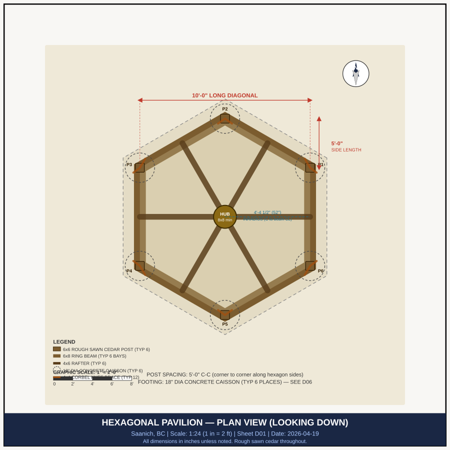
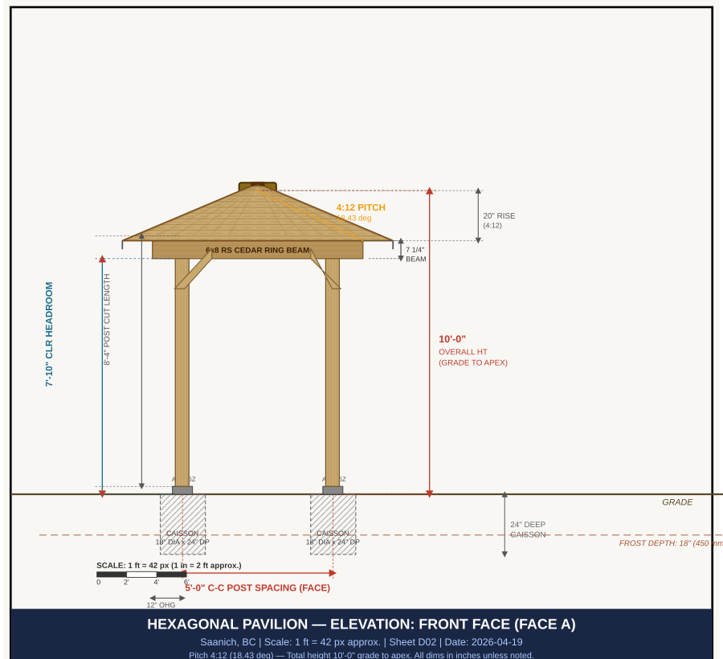
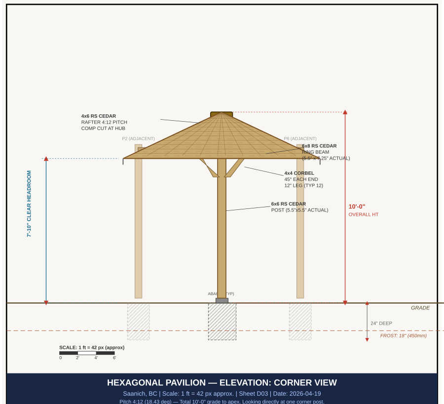
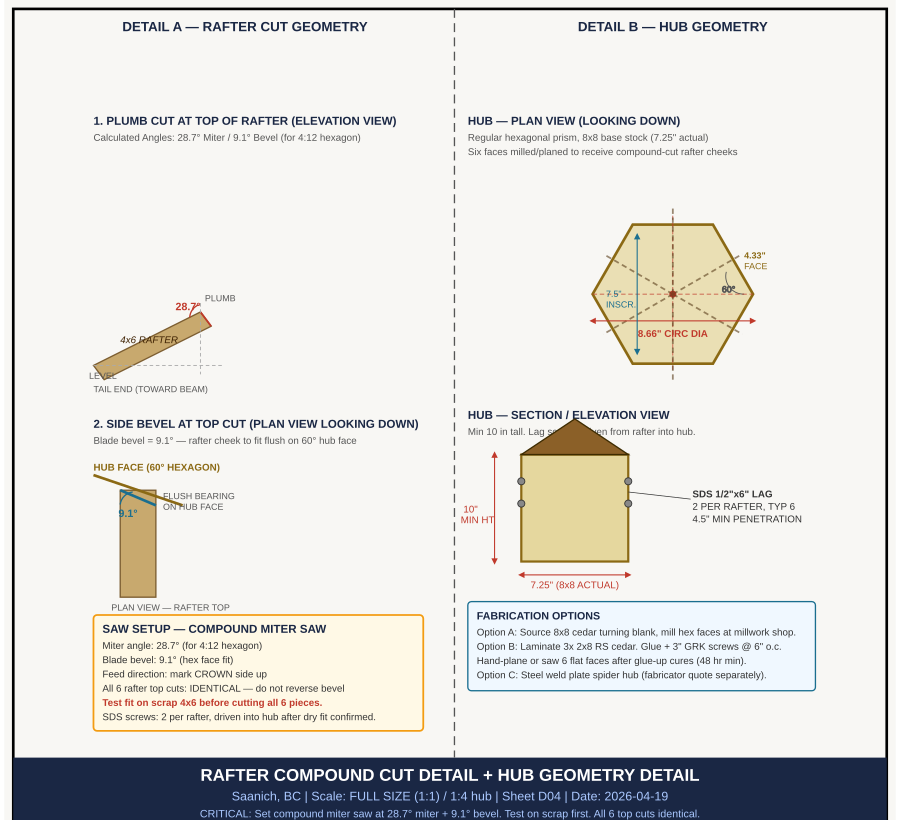
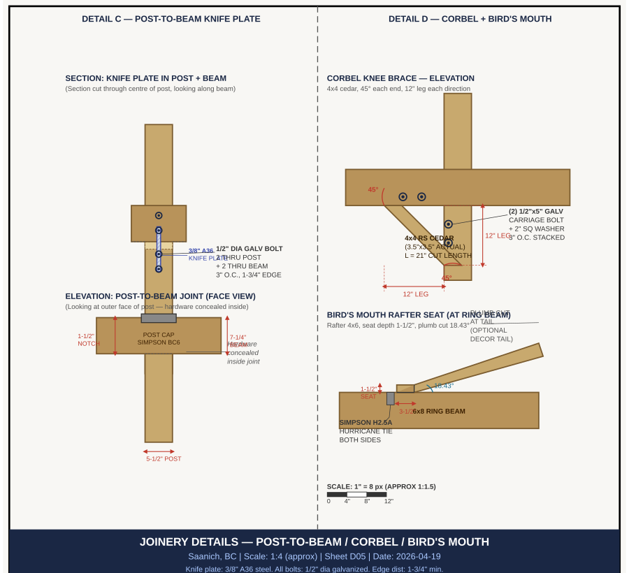
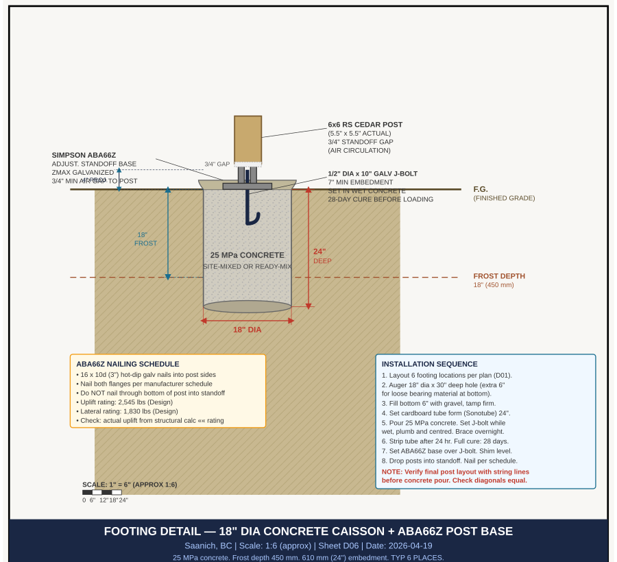
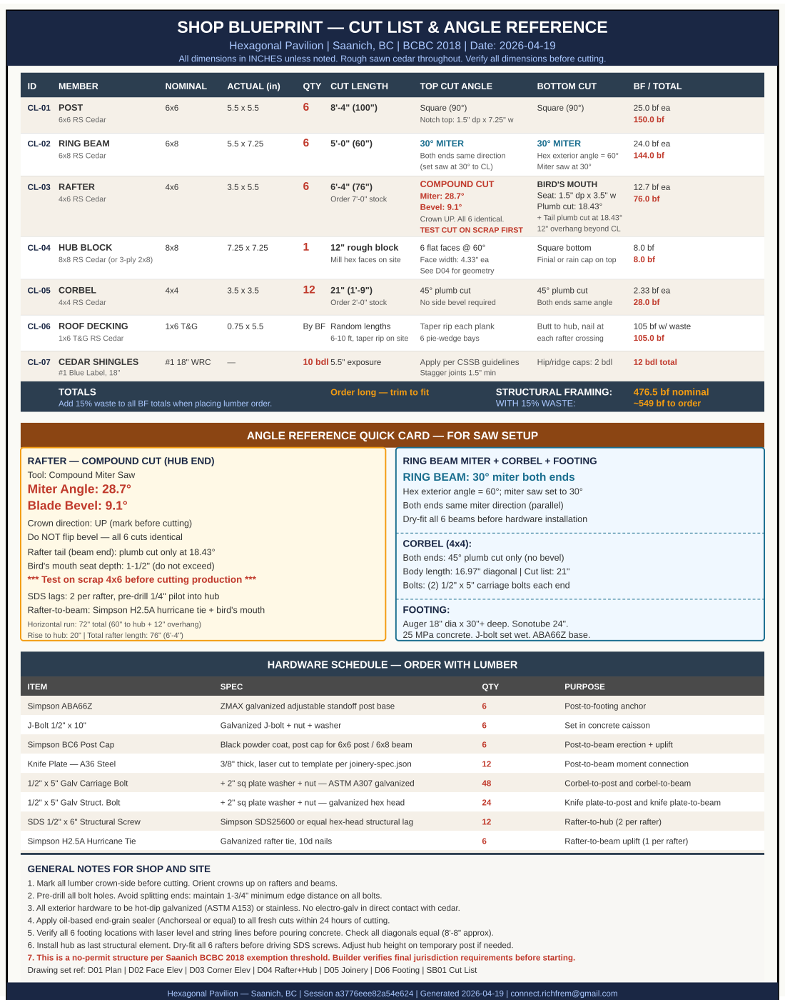

# Construction Documents: Saanich Hexagonal Gazebo (10ft Limit)

**Project:** 10' Regular Hexagon Pavilion  
**Location:** Saanich, BC (V8X)  
**Total Height:** 10'-0" (Grade to Apex)  
**Headroom:** 7'-10" (Clear under beam)  
**Roof Pitch:** 4:12 (18.43°)

---

## 1. Architectural Visualization

*Professional-grade photorealistic 3D rendering of the structure with 6-post topology and 4:12 pitch shingle roof.*

---

## 2. Construction Sheet Set (Standard D-Series)

### Sheet D01: Site & Foundation Plan

### Sheet D02: Sectional Elevation — Front Face

### Sheet D03: Sectional Elevation — Corner View

### Sheet D04: Rafter Compound Cut & Hub Geometry

### Sheet D05: Joinery & Connection Details

### Sheet D06: Footing & Post Base Detail

---

## 3. Shop Blueprint & Fabrication (SB-Series)

### Sheet SB01: Comprehensive Cut List & Angle Card

---

## 4. Final Quality Assurance
The following validation protocols have been completed and passed:
1. **Geometry Axis:** Exactly 6 posts confirmed across all orthographic projections.
2. **Dimension Axis:** All members cross-referenced against `design-spec.json` (7.83' posts, 4:12 pitch rafters).
3. **Height Axis:** 10.0' absolute height limit verified against Grade Y-0 reference.
4. **Human Vision Proxy:** Visual render matches structural topology.

**Construction Documents Authorized for Fabricator Release.**
