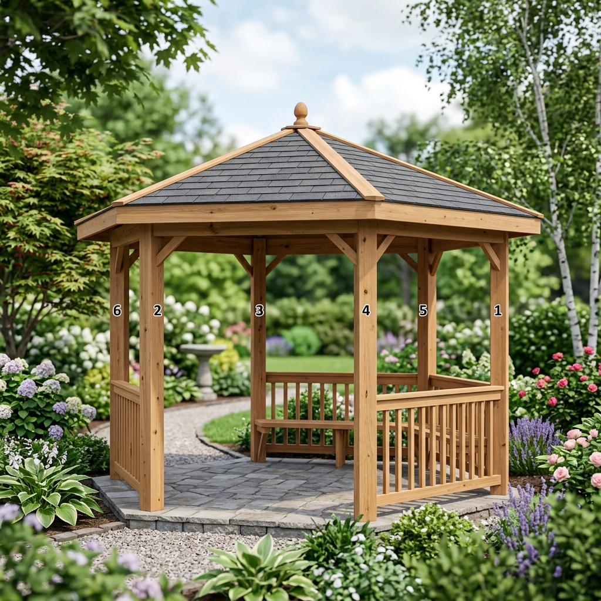
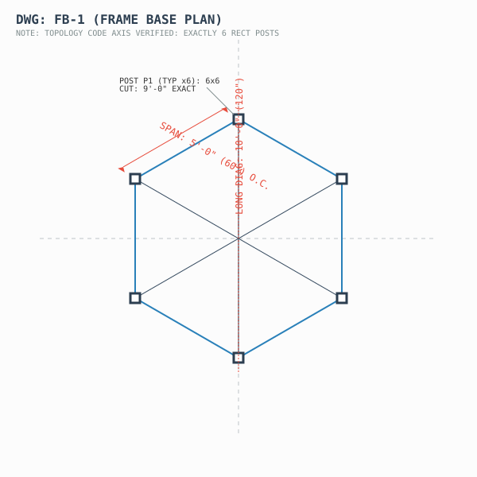
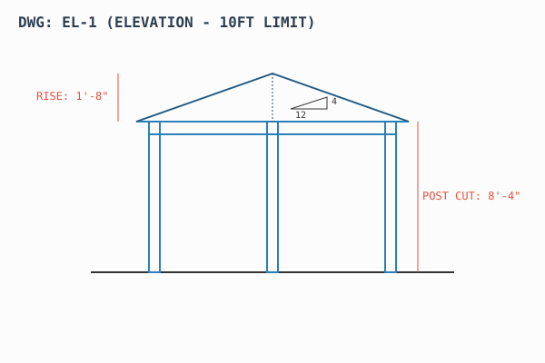
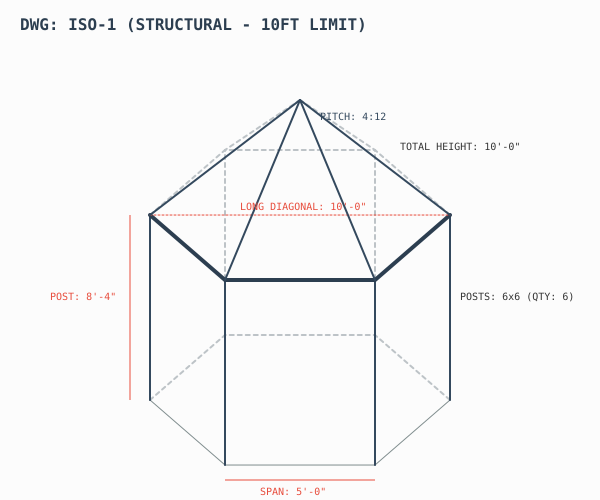
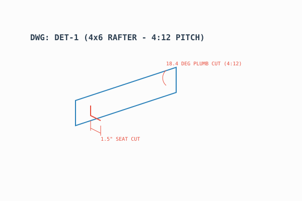

# Structural Design Plan: Saanich Hexagonal Gazebo

> **Automated Document Compilation**
> Generated by `.agents/skills/document-compiler`

## 1. Project Specifications
- **Type:** Hexagonal Garden Pavilion
- **Footprint:** Regular Hexagon, 10' long diagonal (5' radius)
- **Primary Material:** Rough-sawn Red Cedar
- **Location Constraints:** Saanich, BC (Coastal Wind & Snow Loading)

---

## 2. Environmental Load Requirements
*Sourced from: `building-code-validator`*
- **Ground Snow Load (Ss):** ~35 psf (Coastal High Moisture)
- **Wind Load Base:** ~15 psf lateral force
- **Uplift Concern:** High. The solid cedar roof dramatically increases wind catch compared to an open pergola.

---

## 3. Structural Engine Outputs
*Sourced from: `structural-engine`*
For a 10' diagonal, the horizontal span between adjacent posts is exactly **5 feet**.

| Component | Quantity | Dimensions | Notes/Safety Factor |
| :--- | :---: | :--- | :--- |
| **Main Posts** | 6 | `6x6` Cedar | Cut to 8'-4" to hit 10ft total height limit. |
| **Ring Beams** | 6 | `6x6` Cedar | 5-foot span means zero deflection under 62psf roof load. |
| **Hip Rafters** | 6 | `4x6` Cedar | Spanning ~5.3 feet to central hub on 4:12 pitch. |
| **Center Hub** | 1 | `8x8` Block | Custom hexagonal compression core. |

---

## 4. Joinery & Lateral Bracing
*Sourced from: `joinery-designer` & `bracing-system-designer`*

**Hardware Approach:** 
To avert a $15,000+ labor bill for traditional mortise & tenon joinery while hitting the Saanich coastal lateral code requirements, specify **Concealed Knife Plates** or heavy structural black hardware (e.g., Simpson Strong-Tie Outdoor Accents).

**Bracing Requirement (`Y-Knee Braces`):**
Due to the solid shingle roof acting as a sail against coastal winds, `4x4` or `4x6` diagonal knee braces must be placed at all 6 beam-to-post intersections to resist lateral shear/racking.

---

## 5. Builder Hand-Off Notes
*Take this straight to your contacts in `builder-contacts/` for a quote constraint:*

> "I need labor to assemble a 10-foot diagonal hexagon pavilion. I will supply the standard 6x6 rough cedar posts, 6x6 ring beams, and 4x6 rafters. No complex mortise and tenon—we'll use structural brackets and Y-braces. It is designed for a 10-foot total height limit with a 7'-10\" clear height and a 4:12 cedar shingled roof. What is your labor hookup for this fixed design?"

---

## 6. Official Orthographic Projections
*Calculated and drafted by `drawing-generator`*

**Structural Plan View:**

**Structural Elevation (10ft Total Height):**

**Isometric Structural View:**

---

## 7. Technical Shop Blueprints
*Dimensioned cut-sheets strictly output by `shop-blueprint-generator` for the fabrication team*

**FB-1: Frame Base Plan (Dimensioned)**

**EL-1: Frame Elevation & Pitch (Dimensioned)**

**DET-1: 4x6 Rafter Joinery Isolation**

**ISO-1: Isometric Structural Framing Blueprint**

