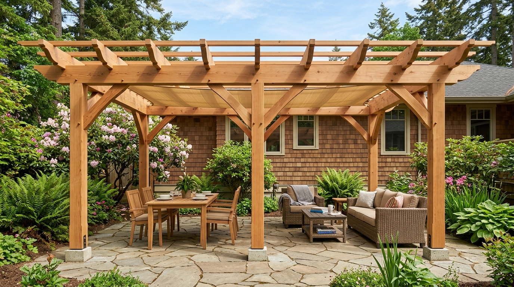

# Structural Timber Framing Construction Plan
## 12' × 18' Rectangular Cedar Pergola Package

**Project Location:** Saanich, BC, Canada (BC Coastal Jurisdiction)  
**Design Standard:** BC Building Code 2024 / Part 9 Timber Framing  
**Ground Snow Load:** 35.0 PSF | **Wind Exposure:** Category B  
**Structure Type:** 6-Post Rectangular Post-and-Beam Pergola with Decorative Scallop Overhangs  
**Material Species:** Heavy Timber Yellow Cedar / Western Red Cedar  

---

## 1. Executive Summary & Design Rationale

This structural package provides complete fabrication specifications, load-path engineering, foundation schedules, and orthographic shop blueprints for a **12' × 18' rectangular heavy-timber pergola**. The layout features a symmetric 6-post grid (9' span along the 18' length and 12' clear transverse span) designed to accommodate zoned outdoor dining and lounge relaxation.

### Core Dimensions & Specifications
- **Footprint:** 18'-0" (Length) × 12'-0" (Width)
- **Clear Height:** 8'-8" (9'-6" Top of Beams, 10'-0" Top of Rafters)
- **Posts (P1–P6):** 6×6 Nominal (5.5" × 5.5" actual) Yellow Cedar, 9'-6" cut length
- **Perimeter Beams (B1–B6):** 4×8 Nominal (3.5" × 7.25" actual) Yellow Cedar
- **Primary Cross-Rafters (R1–R6):** 4×6 Nominal (3.5" × 5.5" actual) with classic decorative scallop profiles
- **Lateral Knee Braces (K1A–K6B):** 4×4 Nominal (3.5" × 3.5" actual) paired 45° knee braces at all post-to-beam junctions
- **Footings (FT1–FT6):** 10" diameter Sonotube concrete piers (minimum 36" depth below frost line) with Simpson Strong-Tie ABA66Z standoff bases
- **Sun Sail Reinforcement:** Engineered tension tie points integrated into beam-post junctions

---

## 2. Photorealistic Architectural Visualization

Below is the approved architectural rendering illustrating the completed 12' × 18' structure in a landscaped West Coast garden setting:

---

## 3. Architectural Drawings (Presentation Layer)

### Sheet A01 — Architectural Plan View

### Sheet A02 — Architectural Elevation View

### Sheet A03 — Isometric Overview

### Sheet A04 — Perspective Framing View

---

## 4. Orthographic Shop Blueprints (Fabrication Layer)

### Sheet S01 — Engineering Foundation & Framing Plan

### Sheet S02 — Structural Framing Elevation & Joint Miters

### Sheet S03 — Structural Isometric Assembly

### Sheet S04 — Component Details & Member Isolation

---

## 5. Bill of Materials & Cut Schedules

Refer to the accompanying standalone builder documentation for complete breakdown:
- **Cut List:** `outputs/fabrication/cut-list.json` & `outputs/shop-blueprint/SB01-cut-list.json`
- **Lumber Purchase Order:** `outputs/lumber-purchase-list.md`
- **Budget Estimate:** `outputs/budget-estimate.md`
- **Assembly Guide:** `outputs/assembly-guide.md`
