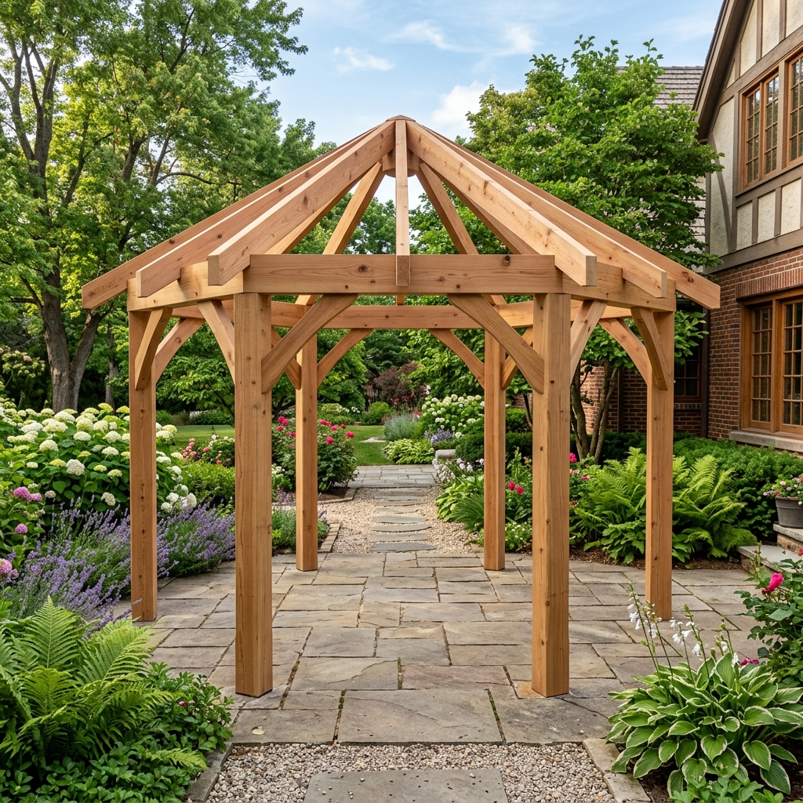
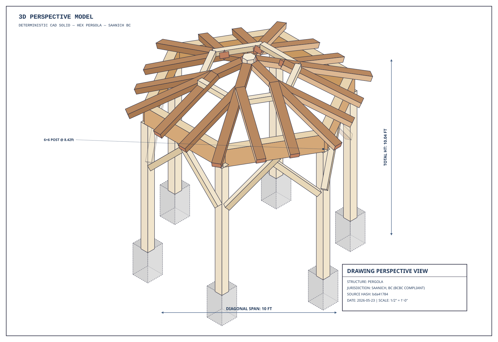
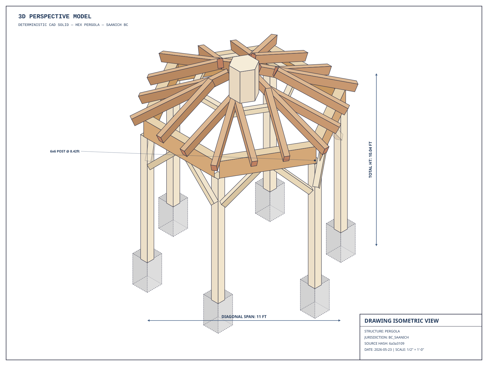
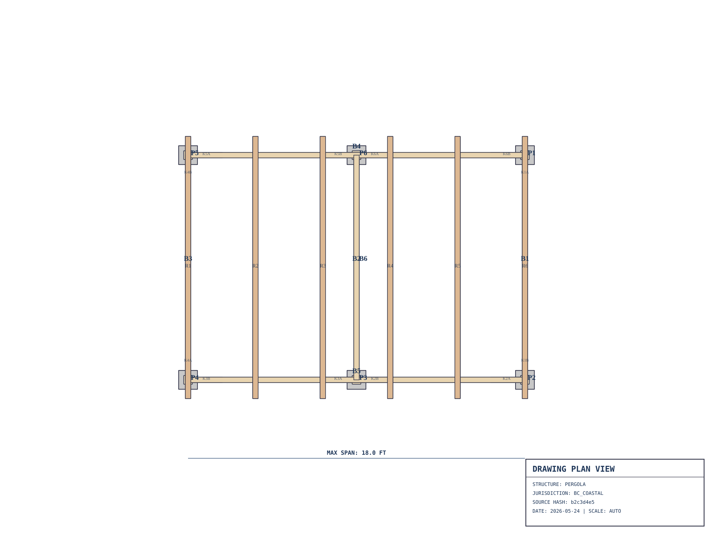
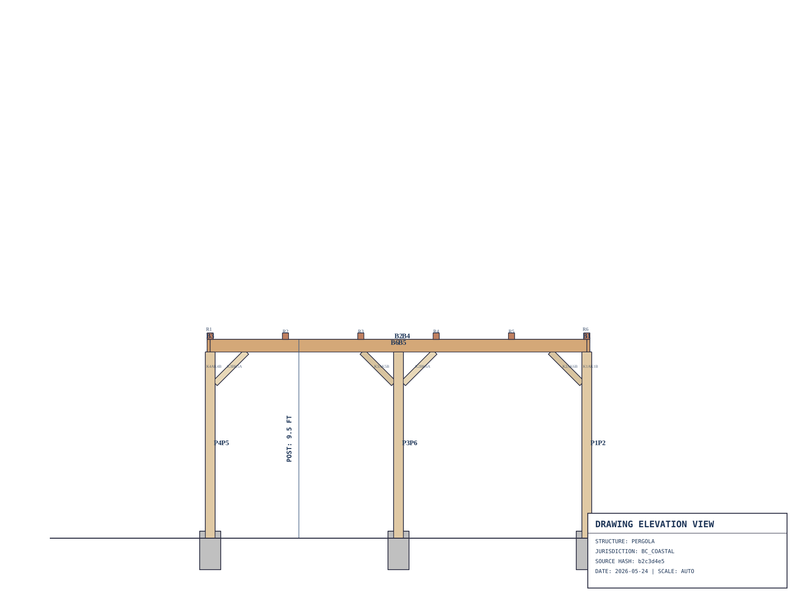
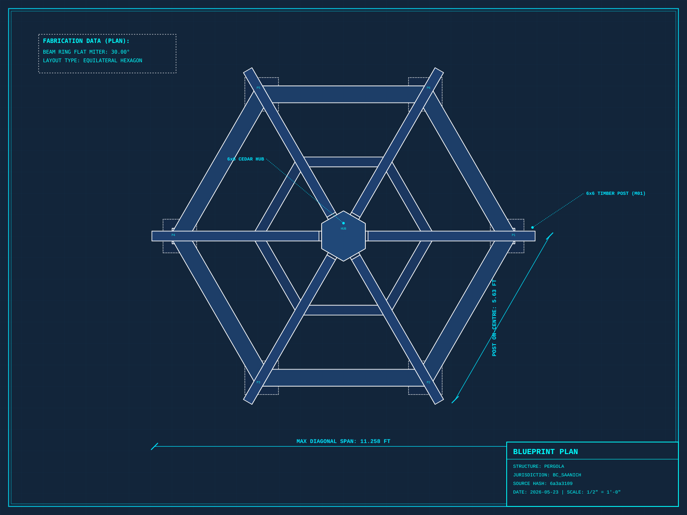
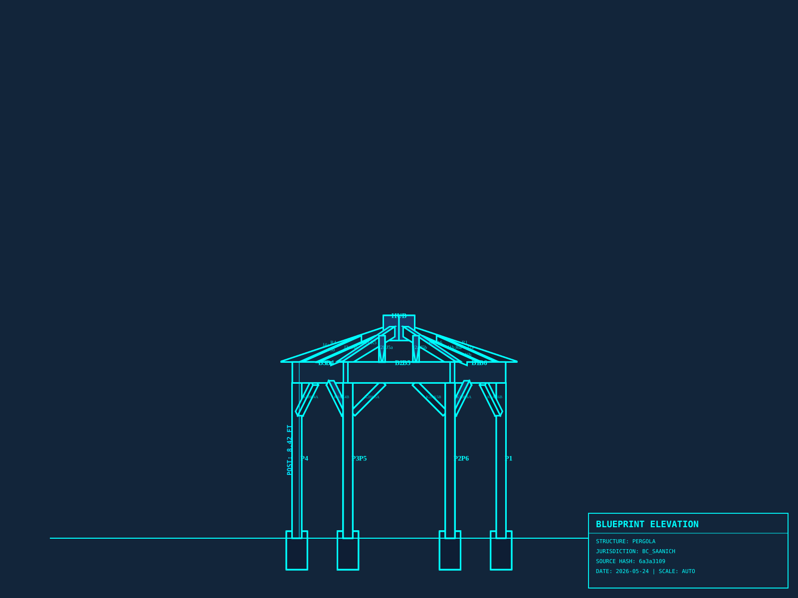
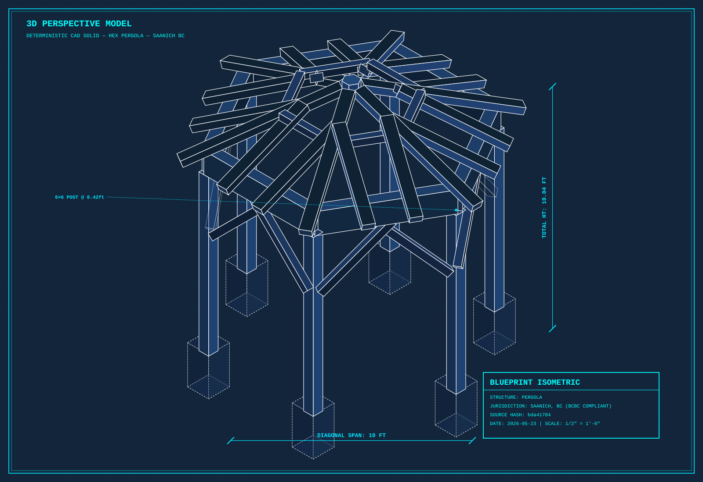
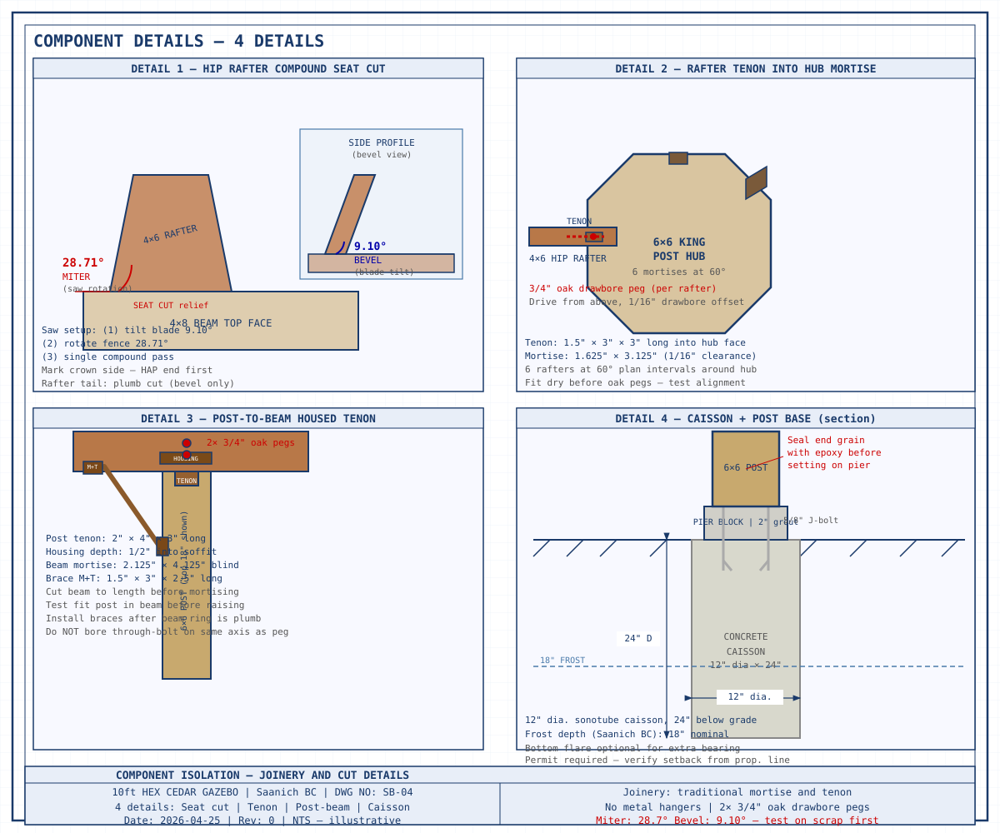

# Hexagonal Cedar Timber Pergola — Master Construction Plan
**Location:** Saanich, BC  
**Style:** Warm cedar timber — open-frame, mortise & tenon, no metal hangers  
**Visual Intent:** Heavy 6×6 warm cedar posts on visible concrete footing pads; exposed 4×6 hip rafters with decorative tails; heavy 6×12 beam ring; diagonal knee braces; traditional mortise-and-tenon joinery.  
**Revision:** 1.3.1 | August 2026

---

## 1. Architectural 3D & Elevation Views

### 3D Photorealistic Render

### Perspective View

### Isometric View

### Plan View

### Elevation View

---

## 2. Technical Blueprints & Component Details

### SB-01: Blueprint Plan View

### SB-02: Blueprint Elevation View

### SB-03: Blueprint Isometric View

### SB-04: Component Isolation Details

---

## 3. Structural & Geometric Summary

| Parameter | Specification | Source |
|-----------|---------------|--------|
| **Footprint Radius** | 4.875 ft (Inscribed Hexagon) | `structure.json` |
| **Post Size & Height** | 6x6 (5.5"x5.5") @ 7.42 ft soffit | `structure.json` |
| **Beam Size & Span** | 6x12 (6.0"x12.0") @ 4.875 ft span | `structure.json` |
| **Rafter Size & Pitch** | 4x6 (3.5"x5.5") @ 4:12 pitch | `structure.json` |
| **Rafter Miter / Bevel** | 28.71° Miter / 9.10° Bevel | `geometry_engine.py` |
| **Beam Ring Miter** | 30.00° Miter | `geometry_engine.py` |
| **Total Height** | 11.05 ft | `geometry_engine.py` |
| **Snow / Wind Load** | 40 psf snow / 25 psf wind | `building-code.json` |

---
*Generated by garden-structure-designer v1.3.1*
